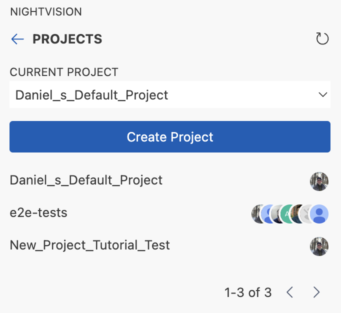
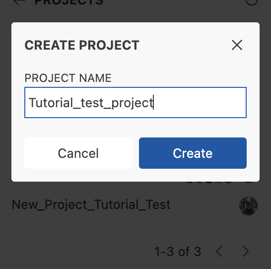
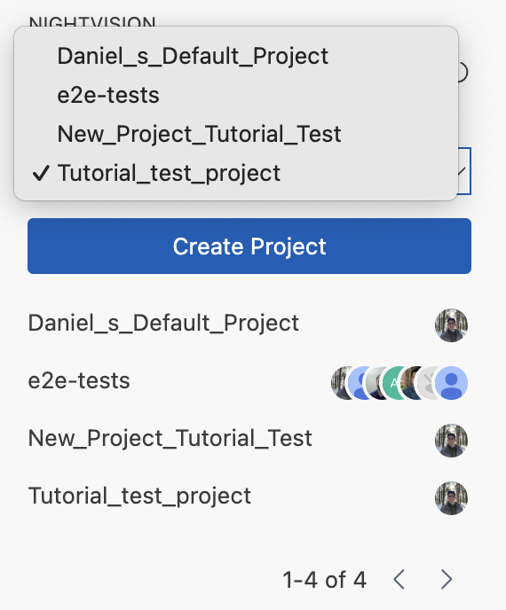
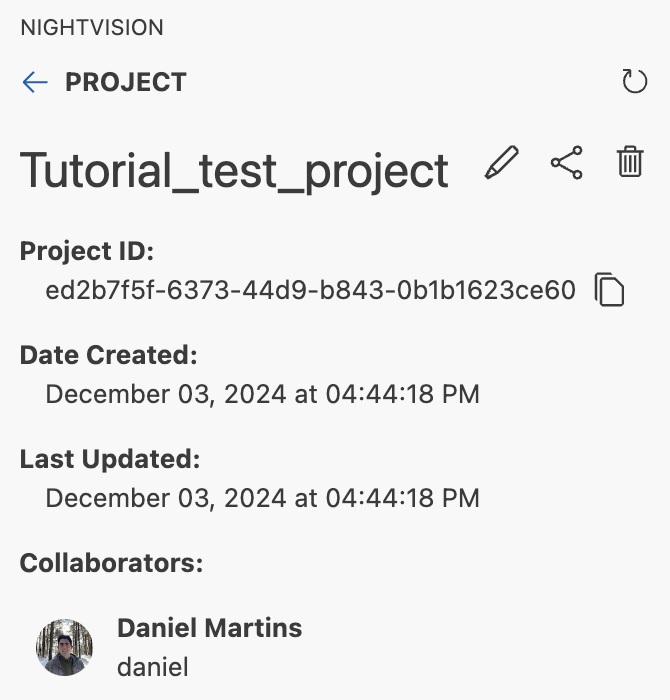
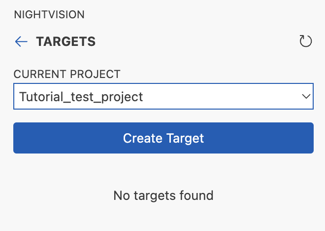
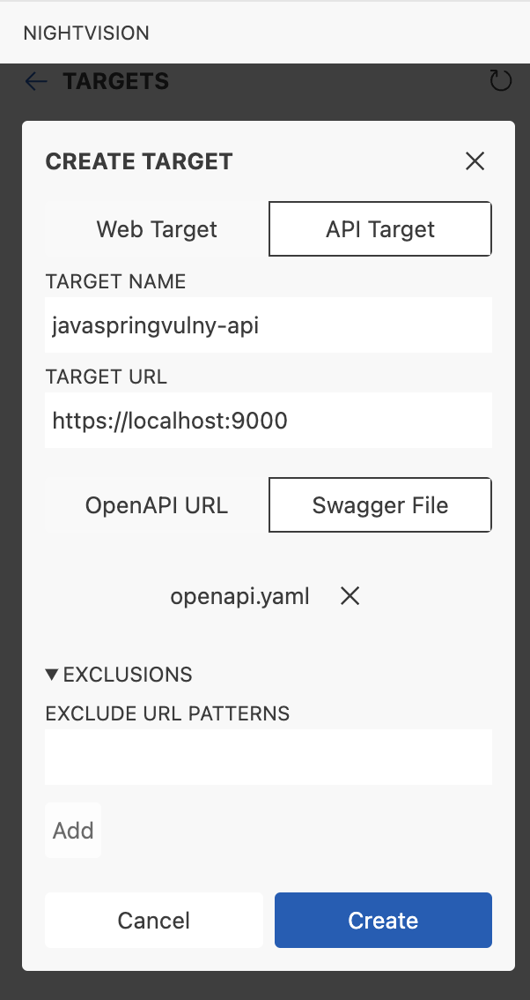
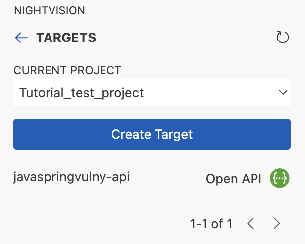
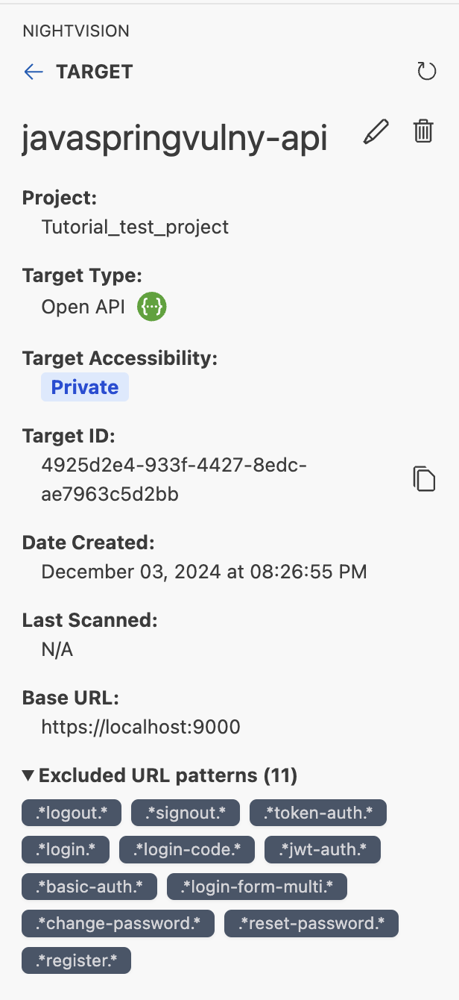

# NightVision Visual Studio Code Extension

    

Leverage [NightVision](https://www.nightvision.net/) to document APIs, run [DAST](https://www.nightvision.net/blog/the-essential-role-of-dynamic-application-security-testing-dast-in-complementing-static-application-security-testing-sast) scans, and uncover vulnerabilities in both known and unknown endpoints!

## Getting Started

In order to use this extension you must have a **NightVision account**. Additionally, it will be required to install the NightVision CLI, that can be done either through this extension or [manually](https://docs.nightvision.net/docs/installing-the-cli). It is available for all platforms: Windows, Linux and MacOS.

### Main page

If you have installed the NightVision CLI and logged in, you'll come to the main page, where you'll be presented with two options:
- [API Discovery](#api-discovery)
- [API Security Testing](#api-security-testing)

### API Discovery

The **API Discovery** helps you document and discover hidden endpoints in your APIs for a set of different languages such as Java, C# (.net), Python, JavaScript / TypeScript and Ruby.
The process is straightforward:
1. Provide the filepath to the root directory of your project to be scanned;
2. Choose the language in which your API is written;
3. Press the button to generate the OpenAPI specification for your project.

If successful, a new window in your VSCode will open with your API information and you can save it at your convenience.

As an example, we can use the [javaspringvulny repository](https://github.com/vulnerable-apps/javaspringvulny):
1. Clone the repo: `git clone https://github.com/vulnerable-apps/javaspringvulny.git`
2. Copy the filepath or select the parent folder;
3. Select the **Java** language.

When generating the OpenAPI specification, you should see something similar to the image below:

### API Security Testing

Here you'll be able to configure and run DAST scans, discovering vulnerabilities in your system.

The image below shows the available options for us to configure our scans. In order to execute a DAST scan, we must first have in place a **project** and a **target**. If you have authentication in your system, you may have to configure an **authentication** method.

#### Configuring a project

1. Click in **Create Project**:

    

2. Type your project name, e.g. **Tutorial_test_project**
    
    

3. Select the project:

    

4. (Optional) Select your project from the list to see its information and see options to edit, delete or share your project with other users:

    

#### Configuring a target

Let's use the [javaspringvulny repository](https://github.com/vulnerable-apps/javaspringvulny) for this example. The application can be started through Docker: `docker-compose up -d; sleep 10`.

Now, let's create our target.

1. Click in **Create Target**:

    

2. Select **API Target**, fill in the data, select the Swagger / OpenAPI file (see [API Discovery section](#api-discovery)) and press the **Create** button:

    

3. After created, you may see it in the list of targets. You can click on a target to see its details:

    

4. You can see the target details. By default, if no excluded URL patterns are provided, some default ones are applied:

    

#### Configuring an authentication

TODO

#### Configuring a scan

TODO

#### Monitoring scans

TODO

#### Authentications

Create a new Playwright authentication named `HTML5-Vulnweb-Auth` and set the URL to `http://testhtml5.vulnweb.com`. This will open a Chrome window at the specified URL. Log in using the username `admin` and password `admin`. This authentication enables comprehensive testing of the website, revealing issues behind login screens and other authentication barriers.

#### Scans

Initiate a new scan using the target and authentication we just set up. NightVision will begin analyzing the website for any vulnerabilities.

You can monitor the scan in progress or review it after completion to see the vulnerabilities the program has identified on the website.

